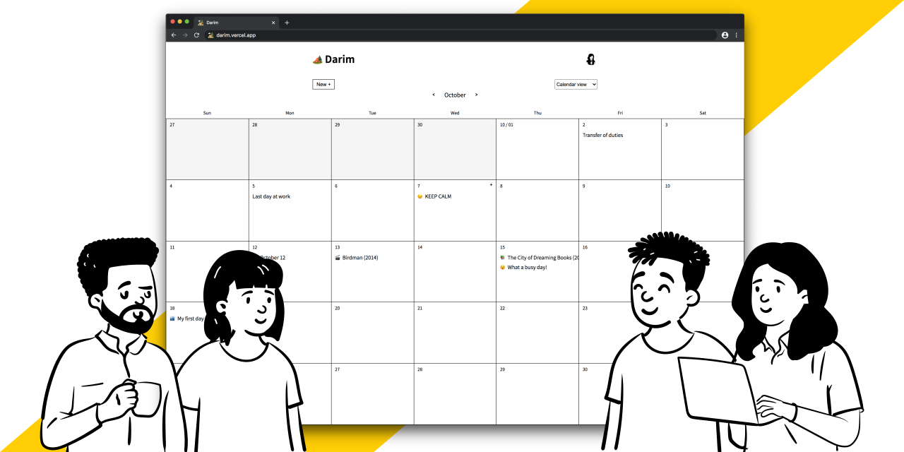
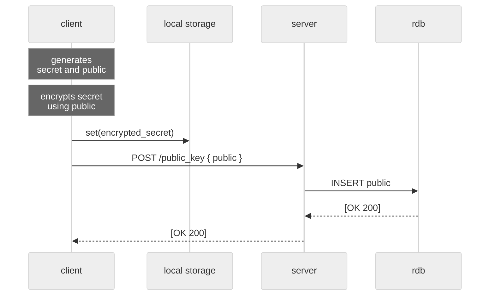
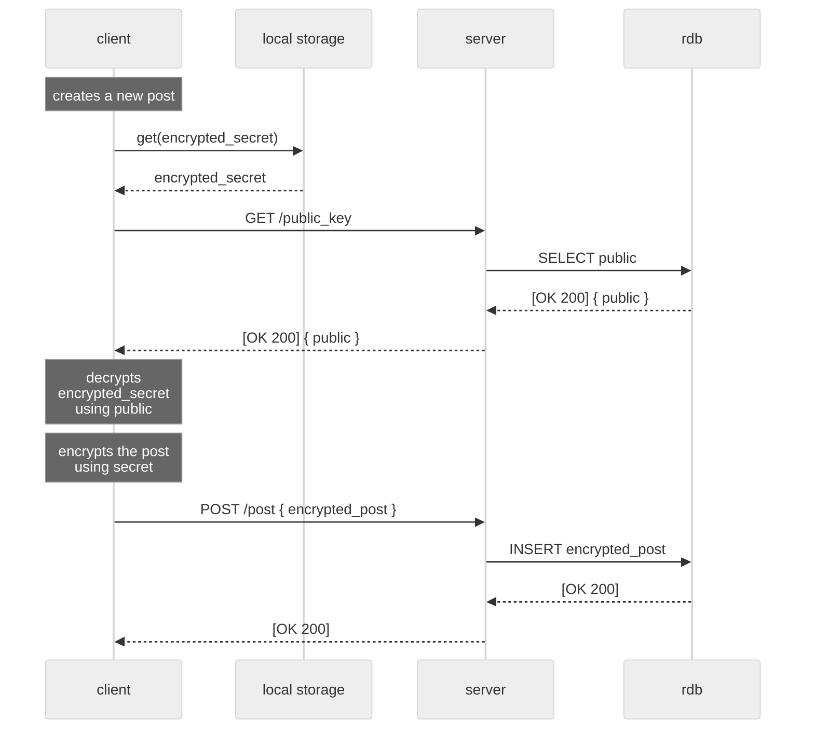

# 🏕 Darim

* Darim: Diary Improved
* Darim is a personal diary service that supports encryption, calendar view, and markdown syntax.
* You can keep your diary a secret even from the developer through client-side encryption.

## Architecture

* Darim is following the layered architecture.
* Each layer cannot be cross-referenced. All references between layers can flow in a higher direction. In other words, only the upper layer can invoke the lower layer members.

### [Client](client)

* `index.html` - An entry point of the application. It is built by parcel.
* Pages - Pages represented by URL. Each page can use general components, API fetchers, and models.
* Components - Reusable components used on multiple pages.

### [API Gateway](api-gateway) & [Server](server)

* `main.rs` - An entry point of the application. It runs a http server.
* Routes - A presentation layer that makes API public and passes request/response data to other layers.
* Services - A business layer that processes the transaction.
* Models - A data layer that can access the database and define data structures.

## Client-side Encryption

Darim supports client-side encryption to protect the user's secrect from others including server.

### Key generation

1. When a user finishes the sign-up process, a secret key and public key are generated on the client-side.
1. The client encrypts the secret key using the public key and saves the encrypted secret key to local storage.
1. The public key is sent to the server, and the server stores it.

### Read & Write

1. After a user creates a new plaintext post, the client requests the public key to the server.
1. The client decrypts the encrypted secret key in the local storage using the public key from the server.
1. The plaintext post is encrypted by the secret key decrypted by the public key.
1. The encrypted post is sent to the server, and the server stores it.

> * At this point, the server can only know encrypted post.
> * If the client reads a post, the flow is the same until the client requests to create a post to the server.

## License

This project is distributed under the AGPL-3.0 License - see the [LICENSE](LICENSE) file for details.
